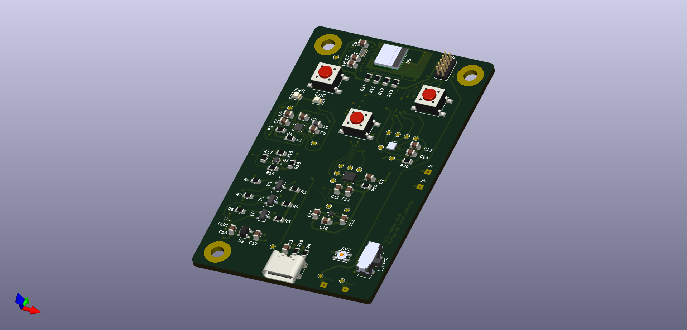

# IMU-mouse

Firmware is implemented as Zephyr based application.

The board devicetree files are found under [`imu_mouse/`](./imu_mouse/).

HW schematics and gerber files can be found under [`hw_design/`](./hw_design/). Full HW design KiCad project is found in separate repo: [github.com/LassiHeikkila/imu-mouse-hw](https://github.com/LassiHeikkila/imu-mouse-hw).

## Status

Working:
- [x] buttons
- [x] battery level reading
- [x] SPI interfaces to both sensors
- [x] BMA456 firmware upload
- [x] BMA456 data polling
- [x] BLE connection to host
- [x] Mouse click

Not working yet:
- [ ] BMA456 interrupts
- [ ] BMA456 any motion / no motion feature configuration
- [ ] BHI360 firmware upload 
- [ ] BHI360 feature configuration
- [ ] BHI360 interrupts
- [ ] Cursor movement
- [ ] BHI360 <-> BMM350 interface

Should be working from SW but maybe HW issue:
- [ ] Status RGB LED

## Pre-requisites for build

### nRF Connect SDK
You must have a working installation of nRF Connect SDK available on your system.

Refer to [the Nordic Semiconductor website](https://www.nordicsemi.com/Products/Development-software/nRF-Connect-SDK) and [nRF Connect SDK page](https://developer.nordicsemi.com/nRF_Connect_SDK/doc/2.6.1/nrf/installation.html) for details on how to install it.

## Dependencies
This project uses the following dependencies:

| What | Version | For what? |
| ---- | ------- | --- |
| nRF Connect SDK | v2.6.1 | Toolchain |
